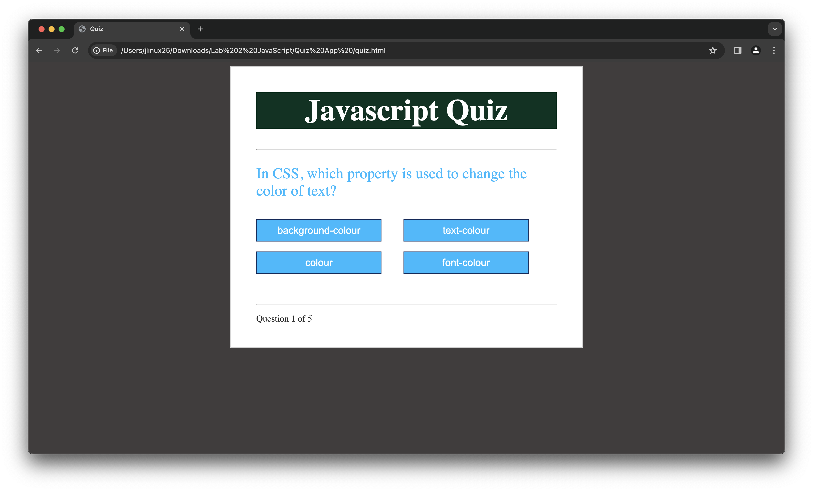

# JavaScript Quiz App

This is a simple JavaScript quiz application that tests your knowledge of JavaScript and related web development concepts.



## Features

- Multiple-choice questions
- Dynamic progress tracking
- Score calculation
- Results display

## How to Use

1. Clone the repository to your local machine:

   ```bash
   git clone https://github.com/anmoljamespilley/Anmol_JS_Lab.git
   ```

2. Open the `index.html` file in your web browser to start the quiz.

3. Answer each question by selecting one of the multiple-choice options provided.

4. After answering all questions, your score and percentage will be displayed.

## Customization

You can easily customize the quiz by modifying the `questions` array in the `index.js` file. Each question is defined with its text, options, and the index of the correct option.

```javascript
const questions = [
    new Question("What is JavaScript?", ["A programming language", "A markup language", "A styling language"], 0),
    // Add more questions here
];
```

## Contributors

